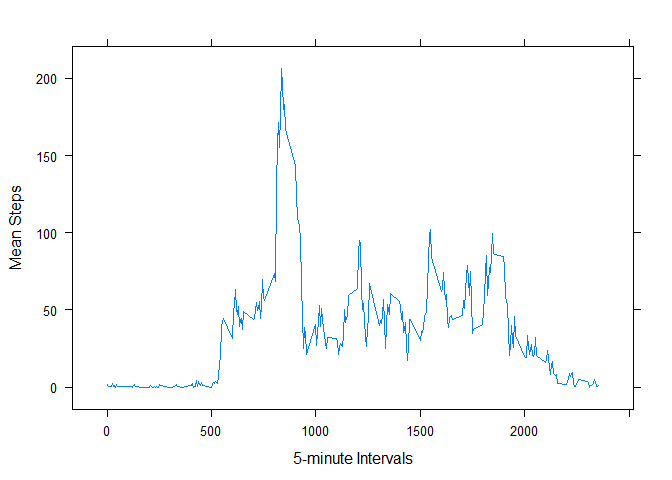

# Reproducible Research: Peer Assessment 1

## Loading and preprocessing the data
As per the instructions for this assignment, the "activity.zip" file from the forked repository was used.  The following steps were taken to load and pre-process the data:

1. Extract the dataset

```r
unzip("activity.zip")
```

2. Read the dataset

```r
activityData <- read.csv("activity.csv")
```

The dplyr and lattice packages were also loaded

```r
library(dplyr)
```

```
## 
## Attaching package: 'dplyr'
## 
## The following objects are masked from 'package:stats':
## 
##     filter, lag
## 
## The following objects are masked from 'package:base':
## 
##     intersect, setdiff, setequal, union
```

```r
library(lattice)
```

Additional processing of the data were performed to answer the questions in the assignment.  These additional processing are discussed below.


## What is mean total number of steps taken per day?

In order to calculate the mean total number of steps taken per day, the dataset was grouped by date, then summarized using total number of steps per day

```r
## Group the activityData by date variable  
activityByDate <- group_by(activityData, date)

## Create a dataframe with sum of steps per date
stepsByDate <- summarize(activityByDate, totalSteps = sum(steps))
```

The stepsByDate data can be visualized using the histogram below

```r
histogram(stepsByDate$totalSteps, xlab="Total Steps")
```

 

The mean total number of steps taken per day can then be calculated and reported. **The mean is 10766 steps, and the median is 10765 steps.**

```r
meanTotalSteps <- mean(stepsByDate$totalSteps, na.rm=TRUE)
print(meanTotalSteps)
```

```
## [1] 10766
```

The same is true for the median total number of steps taken per day.

```r
medianTotalSteps <- median(stepsByDate$totalSteps, na.rm=TRUE)
print(medianTotalSteps)
```

```
## [1] 10765
```


## What is the average daily activity pattern?

To determine the average daily activity pattern, a time series plot of the 5-minute interval (x-axis) versus the average number of steps taken, averaged across all days (y-axis) was created.

In creating the time series plot, the dataset was first grouped by interval, and then summarized using the mean of the steps per date

```r
## Group the activityData by interval variable  
activityByInterval <- group_by(activityData, interval)

## Create a dataframe with mean of steps per date
stepsByInterval <- summarize(activityByInterval, meanSteps = mean(steps, na.rm=TRUE))
```

The time series plot was then created using stepsByInterval

```r
xyplot(stepsByInterval$meanSteps ~ stepsByInterval$interval, stepsByInterval, type="l", xlab="5-minute Intervals", ylab="Mean Steps")
```

 

From this plot, we can identify which 5-minute interval, on average across all the days in the dataset, contains the maximum number of steps. **This 5-minute interval is 835.**

The 5-minute interval that contains the maximum number of steps can be verified using the statement below

```r
stepsByInterval[stepsByInterval$meanSteps==max(stepsByInterval$meanSteps),1]
```

```
## [1] 835
```


## Imputing missing values

The original dataset contains missing values.  The statement below calculates the number of rows with missing values.

```r
totalIncompleteRows <- sum(!complete.cases(activityData))
```

As noted in the assignment instructions, the presence of missing days may introduce bias into some calculations or summaries of the data.

To address the missing values, an imputation strategy is employed.  **In this analysis, the missing values are imputed with the mean of the corresponding 5-minute interval.** 

To preserve the original data, a new dataset called activityDataImputed is created.

```r
activityDataImputed <- activityData
head(activityDataImputed)
```

```
##   steps       date interval
## 1    NA 2012-10-01        0
## 2    NA 2012-10-01        5
## 3    NA 2012-10-01       10
## 4    NA 2012-10-01       15
## 5    NA 2012-10-01       20
## 6    NA 2012-10-01       25
```

The missing values in activityDataImputed are then replaced with the mean of the corresponding 5-minute interval using the for-loop statement below

```r
for(i in 1:nrow(activityDataImputed)){
  if(is.na(activityDataImputed$steps[i])){
    activityDataImputed$steps[i] <- stepsByInterval[stepsByInterval$interval==activityDataImputed[i,3],2]
  }
}
```

The imputation can be previewed in the first five rows of the dataset

```r
head(activityDataImputed)
```

```
##     steps       date interval
## 1 1.71698 2012-10-01        0
## 2 0.33962 2012-10-01        5
## 3 0.13208 2012-10-01       10
## 4 0.15094 2012-10-01       15
## 5 0.07547 2012-10-01       20
## 6 2.09434 2012-10-01       25
```

To view the effect of the imputation, the histogram created above is reconstructed. But this time, the dataset with imputed values is used.


```r
## Group the activityDataImputed by date variable  
activityByDate_2 <- group_by(activityDataImputed, date)

## Create a dataframe with sum of steps per date
stepsByDate_2<- summarize(activityByDate_2, totalSteps = sum(steps))

## Create the histogram of total number of steps taken each day.
histogram(stepsByDate_2$totalSteps, xlab="Total Steps")
```

 

The mean and median of the data with imputed values are also calculated

```r
## Mean of total number of steps taken per day
meanTotalSteps_2 <- mean(stepsByDate_2$totalSteps, na.rm=FALSE)
print(paste("MeanTotalSteps (imputed) ", meanTotalSteps_2))
```

```
## [1] "MeanTotalSteps (imputed)  10766.1886792453"
```

```r
## Median of total number of steps taken per day
medianTotalSteps_2 <- median(stepsByDate_2$totalSteps, na.rm=FALSE)
print(paste("MedianTotalSteps (imputed) ", medianTotalSteps_2))
```

```
## [1] "MedianTotalSteps (imputed)  10766.1886792453"
```
and can now be compared with the mean and median without the imputation

```r
print(paste("MeanTotalSteps ", meanTotalSteps))
```

```
## [1] "MeanTotalSteps  10766.1886792453"
```

```r
print(paste("MedianTotalSteps ", medianTotalSteps))
```

```
## [1] "MedianTotalSteps  10765"
```

The histograms and the calculated mean and median show that the imputation had very little effect.  

The mean was the same for the data without imputation and the data with imputation.  

The median changed slightly:  
  - median without imputation: 10765  
  - median with imputation: 10766.1886792453  

## Are there differences in activity patterns between weekdays and weekends?

To identify any differences in activity patterns between weekdays and weekends, the dataset was processed to add the variables week and weekFactors

```r
## Add week variable
activityDataImputed <- mutate(activityDataImputed, week=weekdays(as.POSIXct(activityDataImputed$date)))

## Add weekFactor column
activityDataImputed <- mutate(activityDataImputed, weekFactor=week)

## Use for-loop to input "weekday" or "weekend"
for(i in 1:nrow(activityDataImputed)){
  if(activityDataImputed[i,4] %in% c("Monday","Tuesday","Wednesday","Thursday", "Friday")){
    activityDataImputed[i,5] <- "weekday"
  }else{
    activityDataImputed[i,5] <- "weekend"
  } 
}

## Make the weekFactor variable a factor
activityDataImputed$weekFactor<- as.factor(activityDataImputed$weekFactor)
```

and a time series plot was created to visualize the data

```r
## Group the activityData by interval variable  
activityByInterval_2 <- group_by(activityDataImputed, weekFactor, interval)

## Create a dataframe with sum of steps per date
stepsByInterval_2 <- summarize(activityByInterval_2, meanSteps = mean(steps, na.rm=FALSE))

## Create the plot
xyplot(stepsByInterval_2$meanSteps ~ stepsByInterval_2$interval | weekFactor, data=stepsByInterval_2, type=c("l","r"), layout=c(1,2), xlab="5-minute Intervals", ylab="Mean Steps")
```

 

Per review of the time series plot, the maximum average number of steps is on a weekday. However, overall, weekends have a slightly higher average number of steps.


